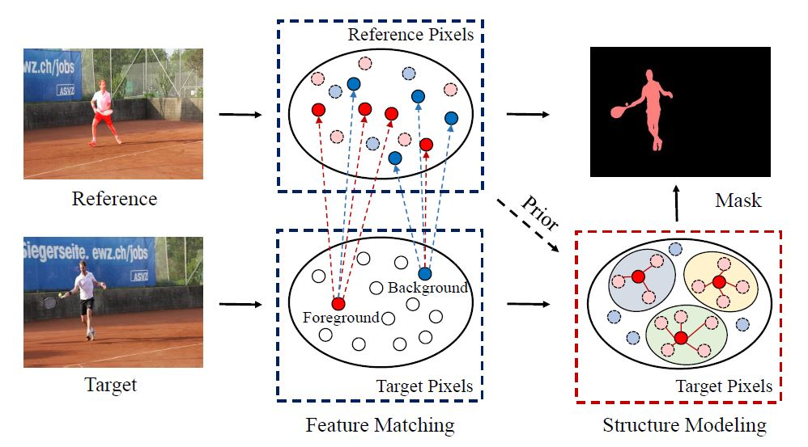

# SSM-VOS: Separable Structure Modeling for Semi-supervised Video Object Segmentation [[paper]](https://ieeexplore.ieee.org/document/9356697)



A PyTorch implementation of our paper [Separable Structure Modeling for Semi-supervised Video Object Segmentation](https://ieeexplore.ieee.org/document/9356697) by [Wencheng Zhu](https://woshiwencheng.github.io/), [Jiahao Li](https://github.com/li-plus), [Jiwen Lu](http://ivg.au.tsinghua.edu.cn/Jiwen_Lu/), and [Jie Zhou](http://www.au.tsinghua.edu.cn/info/1078/1635.htm). Published in [IEEE Transactions on Circuits and Systems for Video Technology](https://ieeexplore.ieee.org/xpl/RecentIssue.jsp?punumber=76).

## Getting Started

First, clone this project to your local environment.

```sh
git clone https://github.com/li-plus/SSM-VOS.git && cd SSM-VOS
```

It is recommended to create a virtual environment with python >= 3.6.

```sh
conda create --name ssm python=3.8
conda activate ssm
```

Install python dependencies.

```sh
pip install -r requirements.txt
```

## Datasets Preparation

### Downloading

Download [DAVIS 2016](https://davischallenge.org/davis2016/code.html), [DAVIS 2017](https://davischallenge.org/davis2017/code.html) train-val and test-dev, and [YouTube-VOS 2018](https://youtube-vos.org/dataset/vos/) datasets from their official websites. Note that for DAVIS 2016 or DAVIS 2017, only the 480p version is needed.

```sh
mkdir -p datasets && cd datasets
# DAVIS 2016
wget https://graphics.ethz.ch/Downloads/Data/Davis/DAVIS-data.zip
unzip DAVIS-data.zip
mv DAVIS DAVIS2016
# DAVIS 2017 Train Val
wget https://data.vision.ee.ethz.ch/csergi/share/davis/DAVIS-2017-trainval-480p.zip
unzip DAVIS-2017-trainval-480p.zip
mv DAVIS DAVIS2017
# DAVIS 2017 Test Dev
wget https://data.vision.ee.ethz.ch/csergi/share/davis/DAVIS-2017-test-dev-480p.zip
unzip DAVIS-2017-test-dev-480p.zip
mv DAVIS DAVIS2017_test
# YouTube-VOS 2018
# Need to sign up for a competition on CodaLab, and manually download the dataset.
```

It is recommended to follow the below structure. If you have saved the datasets into other directory, you may need to make a symbolic link, or manually adjust the path to your datasets in [make_index.py](src/make_index.py).

```
SSM-VOS
└── datasets
    ├── DAVIS2016
    │   ├── Annotations
    │   ├── ImageSets
    │   └── JPEGImages
    ├── DAVIS2017
    │   ├── Annotations
    │   ├── ImageSets
    │   └── JPEGImages
    ├── DAVIS2017_test
    │   ├── Annotations
    │   ├── ImageSets
    │   └── JPEGImages
    └── YouTubeVOS
        ├── train
        │   ├── Annotations
        │   ├── JPEGImages
        │   └── meta.json
        └── valid
            ├── Annotations
            ├── JPEGImages
            └── meta.json
```

### Indexing

To simplify the codes for data loading, we firstly index training, validation, and test set for all datasets.

```sh
python make_index.py
```

## Evaluation

Our pretrained models on DAVIS 2016, DAVIS 2017, and YouTube-VOS 2018 are available for download.

```sh
mkdir -p models/pretrained && cd models/pretrained
wget https://www.dropbox.com/s/7dctisjdrl2b47c/ssm_davis16.pt -O ssm_davis16.pt
wget https://www.dropbox.com/s/ew2d2gy3rldxob9/ssm_davis17.pt -O ssm_davis17.pt
wget https://www.dropbox.com/s/jm24vm2puprcldz/ssm_youtube.pt -O ssm_youtube.pt
```

To evaluate a given model on a specific dataset, specify the path to model and the corresponding split file. For example, to evaluate the pretrained model on DAVIS 2017, run

```sh
CUDA_VISIBLE_DEVICES=0 python evaluate.py --split ../splits/davis2017_val.json \
    --resume ../models/pretrained/ssm_davis17.pt --save-dir ../models/pretrained/results/davis17/
```

The script will generate separate mask results for each object and save them in the given `--save-dir`. We then merge the separate results into final masks.

```sh
python merge_masks.py -i ../models/pretrained/results/davis17/ \
    -o ../models/pretrained/results/davis17_merged/
```

To evaluate the performance on DAVIS 2017, we apply the [official evaluation codes for DAVIS 2017](https://github.com/davisvideochallenge/davis2017-evaluation). Please follow its instructions to evaluate the final results.

Similarly, to evaluate our pretrained model on DAVIS 2016, run

```sh
CUDA_VISIBLE_DEVICES=0 python evaluate.py --split ../splits/davis2016_val.json \
    --resume ../models/pretrained/ssm_davis16.pt --save-dir ../models/pretrained/results/davis16/

python merge_masks.py -i ../models/pretrained/results/davis16/ \
    -o ../models/pretrained/results/davis16_merged/
```

Please use the [official evaluation codes for DAVIS 2016](https://github.com/davisvideochallenge/davis-2017) to evaluate the final mask results.

## Training

### YouTube-VOS 2018

We pretrain our model on YouTube-VOS with 4 GeForce GTX 1080 Ti GPU devices.

```sh
CUDA_VISIBLE_DEVICES=0,1,2,3 python train.py \
    --model-dir ../models/youtube --split ../splits/youtube_train.json
```

You may start tensorboard to keep track of the training process.

```sh
tensorboard --logdir ../models/youtube/board
```

### DAVIS 2017

For better performance, we further train our model only on DAVIS 2017 based on the best pretrained model, say 80999.pt.

```sh
CUDA_VISIBLE_DEVICES=0,1,2,3 python train.py \
    --model-dir ../models/davis17 --split ../splits/davis2017_train.json \
    --resume ../models/youtube/checkpoints/80999.pt --max-epoch 60 \
    --base-lr 1e-6 --save-step 640 --lr-decay-step 1920
```

### DAVIS 2016

Similarly, we also train our model on DAVIS 2016.

```sh
CUDA_VISIBLE_DEVICES=0,1,2,3 python train.py \
    --model-dir ../models/davis16 --split ../splits/davis2016_train.json \
    --resume ../models/youtube/checkpoints/80999.pt --max-epoch 100 \
    --base-lr 1e-6 --save-step 130 --lr-decay-step 650
```

## Citation

If you find our paper or code helpful in your research, feel free to cite it.

```
@article{zhu2021separable,
  title={Separable Structure Modeling for Semi-supervised Video Object Segmentation},
  author={Zhu, Wencheng and Li, Jiahao and Lu, Jiwen and Zhou, Jie},
  journal={IEEE Transactions on Circuits and Systems for Video Technology},
  year={2021},
  publisher={IEEE}
}
```
